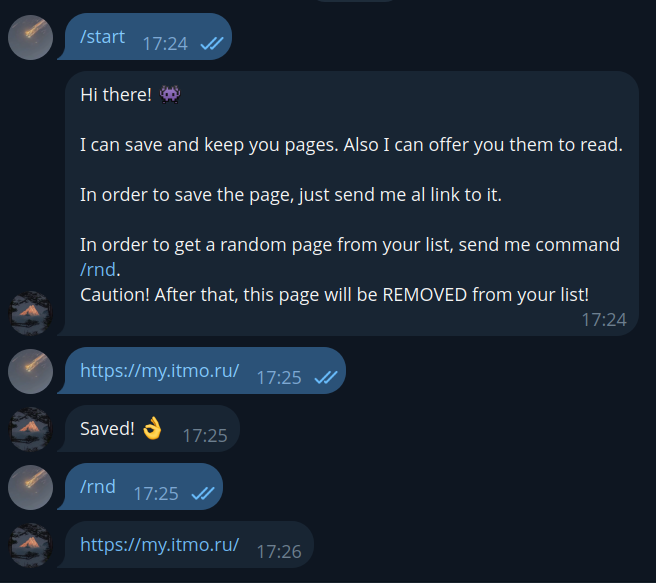

# ReadAdviserBot 🤖📚

Telegram-бот для управления списком отложенного чтения. Помогает не копить сотни ссылок в «Избранном», а системно их читать.

 

## 💡 Бизнес-логика

Бот предоставляет персональное хранилище ссылок для каждого пользователя. 

* **Сохранение ссылок**: Отправьте боту любое сообщение, содержащее URL. Бот проверит валидность ссылки и сохранит в базу.
* **Выдача случайного материала (`/rnd`)**: Бот выбирает случайную ссылку из вашего списка и отправляет её вам.
* **Автоудаление прочитанного**: Сразу после выдачи ссылки по команде `/rnd`, она **навсегда удаляется** из вашей базы. Это главная фича бота — заставлять пользователя читать, а не просто складировать материал.
* **Базовые команды**: `/start` и `/help` для вывода справочной информации.

## 🏗 Архитектура

Проект построен по принципам Clean Architecture с использованием Dependency Injection. Бизнес-логика полностью изолирована от инфраструктуры.

**Схема движения данных (Data Flow):**
```text
Telegram API ──[Long Polling]──▶ Fetcher ──[Events]──▶ Processor ──[CRUD]──▶ SQLite
```

## 📂 Структура проекта

* `clients/telegram` — низкоуровневый HTTP-клиент к Telegram Bot API.
* `events/telegram` — абстракция «событий» поверх Telegram, парсинг входящих сообщений и маршрутизатор команд.
* `consumer` — движок приложения: бесконечный цикл `for`, реализующий паттерн «забрать пачку событий → отдать в обработку».
* `storage` — интерфейс хранилища и его конкретная реализация на базе `SQLite`.

## 🚀 Quick Start

**Требования:** Установленный Go (1.18+) и компилятор gcc (для драйвера go-sqlite3).

1. Склонируйте репозиторий:
```bash
git clone https://github.com/Zhenka07/TelegramBot.git
cd TelegramBot
```

2. Выполните первичную настройку (создаст конфигурационный файл `.env`):
```bash
make setup
```

3. Откройте созданный файл `.env` и впишите туда токен вашего бота (получить можно у [@BotFather](https://t.me/BotFather)):
```text
TELEGRAM_API_KEY=123456789:ABCdefGhIJKlmNoPQRstuVwXyz
```

4. Запустите бота:
```bash
make run
```

Бот создаст файл базы данных `data.db` и начнет опрашивать сервер Telegram.

## 🛠 Доступные Makefile команды
* `make run` — запуск приложения.
* `make build` — компиляция бинарного файла.
* `make setup` — подготовка окружения для локальной разработки.
```